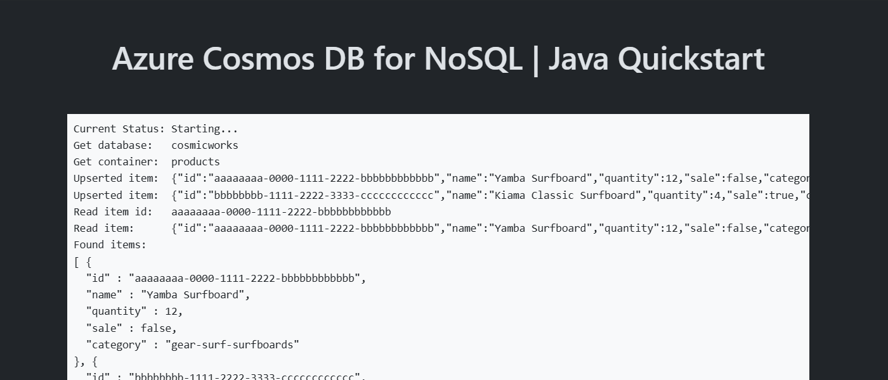

# Quickstart: Azure Cosmos DB for NoSQL client library for Java

This is a simple Spring Web application to illustrate common basic usage of Azure Cosmos DB for NoSQL's client library for Java. This sample application accesses an existing account, database, and container using the [`azure-spring-data-cosmos`](https://mvnrepository.com/artifact/com.azure/azure-spring-data-cosmos) and [`azure-identity`](https://mvnrepository.com/artifact/com.azure/azure-identity) packages from Maven.

### Prerequisites

- [Docker](https://www.docker.com/)
- [Azure Developer CLI](https://aka.ms/azd-install)
- [Java 21](https://learn.microsoft.com/java/openjdk/download#openjdk-21)

### Quickstart

1. Log in to Azure Developer CLI.

    ```bash
    azd auth login
    ```

    > [!TIP]
    > This is only required once per-install.

1. Initialize this template (`cosmos-db-nosql-go-quickstart`) using `azd init`

    ```bash
    azd init --template cosmos-db-nosql-go-quickstart
    ```

1. Ensure that **Docker** is running in your environment.

1. Use `azd up` to provision your Azure infrastructure and deploy the web application to Azure.

    ```bash
    azd up
    ```

1. Observed the deployed web application

    
